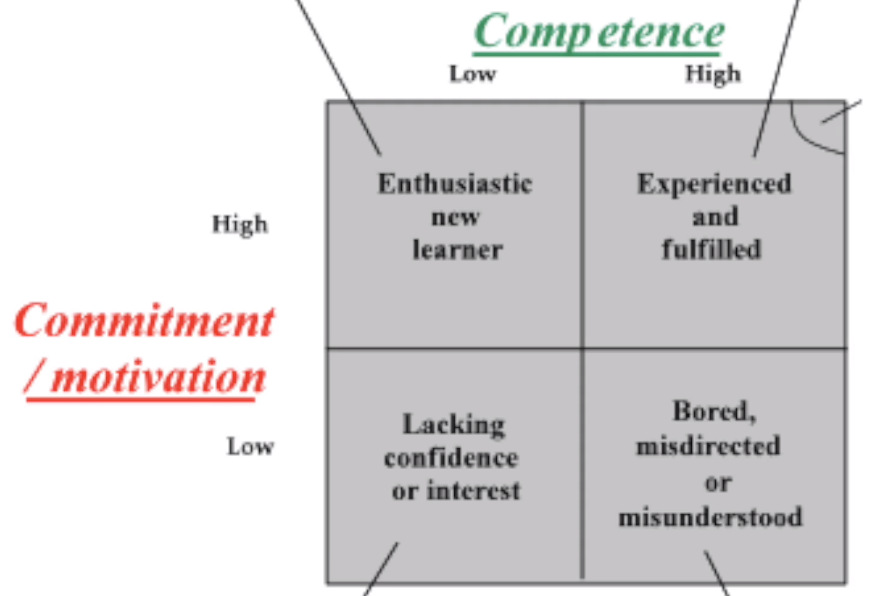
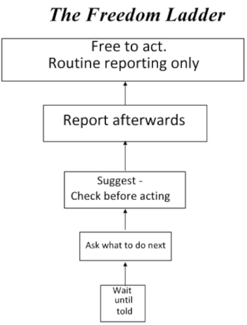

# Leadership: Practical Leadership Skills

## 2. What is a Leader?

## 3. Motivation

## 4. Leadership Styles (part 1)

## 5. Delegating

### 5.1 Empowerment

- Trusting & Supporting
- Spend time adding value
- You must keep your word
- Trust leads to ownership

### 5.2 Why delegate?

- Motivation (achievement)
- Better quality work
- Learning
- Save time
- Less risk
- Promotions loom

### 5.3 Objections

- Fear of unknown: monitoring to start with
- Fear of overtaking: collaborator's success is also the management success
- Too busy: pays off in the future
- I like it: must be passed down
- I need tasks: more time to macro management, vision, etc
- No bandwidth: tradeoff between efficiency and quality

### 5.4 Leadership without management

- What if I wasn't here?
- Delegate and support
- Leaders shouldn't be taking trivial decisions

### 5.5 How to Delegate

- Delegate at 80%
  - if collaborators are reaching 80% of the quality, the remainder 20% should be ignored in most of the cases
- Use delegating as training
- Delegate to the collaborator who would face the task as a challenge
- 8 steps:
  1. What you want
  2. Why it is important
  3. Why them
  4. What the limits are
  5. Reporting process
  6. Offer support
  7. Double check (Is everything clear? OK?)
  8. Reinforce trust/believe (You can do it)

### 5.6 Taking the monkey

- Problems from collaborators that you offer to handle
- Don't take the monkey
  - "Leave it with me" is not a good approach
- Offer suggestion
- Follow up
- If "I do not know":
  - "How long it would take to you to think and come up with a plan/ideas/suggestions"
  - Loop
- Pass on your authority

## 6. Leadership Styles (part 2)

### 6.1 Competencies

- Situational Leadership (Hersey & Blanchard): The One Minute Manager
  
  - Top Right: delegate or empower dilemma
  - Top Left: new joiners; unsustainable after some time (mentoring, training)
  - Bottom Right: bad management; involving style, involve collaborator in decisions (pull information out) thanking them for their help
  - Bottom Left: give them chances; were they trained? (pull information in)

### 6.2 What if it goes wrong?

- Multi dimensional competencies: Technical, Personal, Project Management, etc.
- Money as motivator: does not work alone

### 6.3 Freedom Ladder

### 6.4 Deciding Grip

- How much grip you want to keep while delegating
  - Every day, week, on occurrences, etc
- Weekly meeting
- Visual chart
- Under-performers: tighter grip, drill down
  - Can I see your plan?
  - Tightest grip: daily task list

### 6.5 Plan & Do

- Planning: Tannenbaum & Schmidt
- Doing: Freedom Ladder
