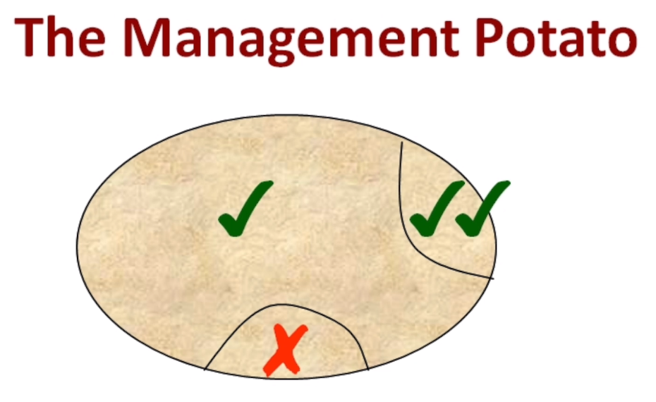
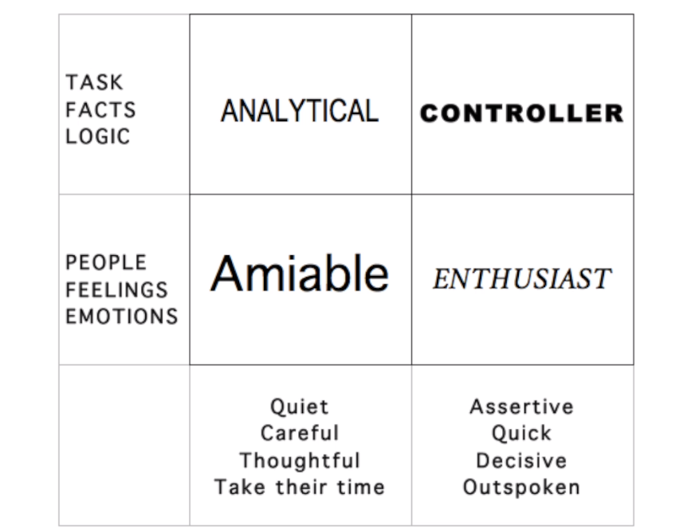
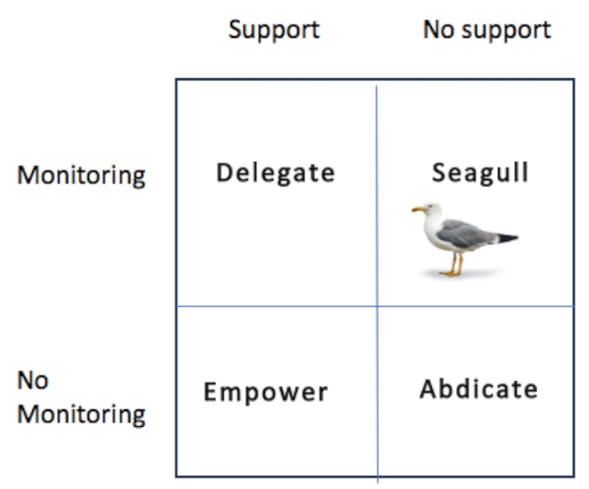

# Leadership: Practical Leadership Skills

## 2. What is a Leader?

### 2.1 Captain

- Customer care
- Quality obsession
- In touch with the workers
- Hands off
- Build a "machine of people"
- Tripod: `People - Systems - Vision`
- Always responsible, held accountable
- Short term, the leader should not be missed

### 2.2 Responsibility

- Issues and faults: supervision?
- Lack of training?
- Lack of motivation?
- Wrong person doing the job?
- Everything is management's fault

### 2.3 Re-connecting

- Management by Wandering About: walk around frequently (daily, preferably) talking to people
  - Gain Information
  - Distribute Information
- Back to the floor
  - Perform lowest job once a year, for instance
  - No need to be secretive
  - Make better decisions
  - Getting back in touch

### 2.4 Communication

- "He/She who communicates, leads"

1. Information Cascade: Upper management -> Middle management -> Collaborators
2. Team Meetings: once a week, at all levels
3. Addressing the Troops: once a year, all employees

### 2.5 Leaders: born or made?

- Transactional Leadership: What you DO, not what you ARE
- Anyone can be a good leader
- Action Centered Leadership (Blake & Mouton)

1. Task gets done
2. Team is happy
3. Individuals are happy

- 5 stages:

1. Objectives
2. Planning
3. Briefing (explaining the planing)
4. Action
5. Review

## 3. Motivation

### 3.1 Maslow's Hierarchy of Needs

- Physiological needs (survival): food, water, warmth, rest
- Safety needs: security, safety
- Belonging and Love needs: intimate relationships, friends
- Esteem needs: prestige and feeling of accomplishment
- Self-actualization: achieving one's full potential

### 3.2 Management Potato

- Praise strengths often
- Support improvement

  - "What will you do differently next time?"
  - Always be positive on the area of improvement
  - Shit sandwich:
    - Good news, bad news, good news

### 3.3 Types of people

- analytical: give ownership and independence
- controller: empower and challenge
- enthusiast: vision of the future
- amiable: give time and nurture

### 3.4 Money as a motivator

- A pull motivator, not a push motivator
- Below a certain point, money works
- Pay increase: short term affect
- Mechanical tasks: more money = more output
- Non-Mechanical tasks: more money = less output
  - sense of unfairness
- Quality and productivity shouldn't be connected to salary
  - And it they are, the employee is only performing that task because of money
  - Wrong job

### 3.5 Motivational Essentials

1. Give everyone ownership of something
2. Involve people as much as possible in decisions
3. Give everyone a challenge
4. Let people set their own objectives
5. Do regular appraisals
6. Provide security - give information, be consistent
7. Give lots of praise and encouragement
8. Thank people - everyone at least once a week
9. Coach rather than criticize
10. Know what motivates each unique person
11. Offer constant learning
12. Give individual progress goals, and team ones
13. Involve people in their own development plan
14. Are people fulfilling their potential?
15. Give people time to talk to you
16. Keep tasks novel and interesting
17. Create a sociable environment
18. Build a team ethos and feeling
19. Make money a reliable constant
20. Set a role model example

## 4. Leadership Styles (part 1)

### 4.1 How much control should you keep

- Tannenbaum & Schmidt: `Management Continuum`
  - Tells: quick & simple
    - "I want this, that way".
  - Sells: pretty quick, slightly motivational
    - "This should be done that way because..."
  - Consults: slower and less control, more motivational. Still taking the final decision
    - "I want to this, in that way. What do you think?"
  - Shares: relinquish control, extremely slow. Each collaborator and manager have the same participation/share in the final decision
  - Delegates: no control, very fast and motivational, monitoring.
    - "I've decided we should do this, and how you gonna achieve that is up to you. I will control/monitor the development of the task and can support you."
  - Empowerment:
    - "I've decided we should do this, and how you gonna achieve that is up to you. I will support you in any issue or important decision, if you have any."
  - Abdicate:
    - "I've decided we should do this, and how you gonna achieve that is up to you. I do not care."

### 4.2 Delegating - Types

## 5. Delegating

### 5.1 Empowerment

- Trusting & Supporting
- Spend time adding value
- You must keep your word
- Trust leads to ownership

### 5.2 Why delegate?

- Motivation (achievement)
- Better quality work
- Learning
- Save time
- Less risk
- Promotions loom

### 5.3 Objections

- Fear of unknown: monitoring to start with
- Fear of overtaking: collaborator's success is also the management success
- Too busy: pays off in the future
- I like it: must be passed down
- I need tasks: more time to macro management, vision, etc
- No bandwidth: tradeoff between efficiency and quality

### 5.4 Leadership without management

- What if I wasn't here?
- Delegate and support
- Leaders shouldn't be taking trivial decisions

### 5.5 How to Delegate

- Delegate at 80%
  - if collaborators are reaching 80% of the quality, the remainder 20% should be ignored in most of the cases
- Use delegating as training
- Delegate to the collaborator who would face the task as a challenge
- 8 steps:
  1. What you want
  2. Why it is important
  3. Why them
  4. What the limits are
  5. Reporting process
  6. Offer support
  7. Double check (Is everything clear? OK?)
  8. Reinforce trust/believe (You can do it)

### 5.6 Taking the monkey

- Problems from collaborators that you offer to handle
- Don't take the monkey
  - "Leave it with me" is not a good approach
- Offer suggestion
- Follow up
- If "I do not know":
  - "How long it would take to you to think and come up with a plan/ideas/suggestions"
  - Loop
- Pass on your authority

## 6. Leadership Styles (part 2)

### 6.1 Competencies

- Situational Leadership (Hersey & Blanchard): The One Minute Manager
  
  - Top Right: delegate or empower dilemma
  - Top Left: new joiners; unsustainable after some time (mentoring, training)
  - Bottom Right: bad management; involving style, involve collaborator in decisions (pull information out) thanking them for their help
  - Bottom Left: give them chances; were they trained? (pull information in)

### 6.2 What if it goes wrong?

- Multi dimensional competencies: Technical, Personal, Project Management, etc.
- Money as motivator: does not work alone

### 6.3 Freedom Ladder

### 6.4 Deciding Grip

- How much grip you want to keep while delegating
  - Every day, week, on occurrences, etc
- Weekly meeting
- Visual chart
- Under-performers: tighter grip, drill down
  - Can I see your plan?
  - Tightest grip: daily task list

### 6.5 Plan & Do

- Planning: Tannenbaum & Schmidt
- Doing: Freedom Ladder
